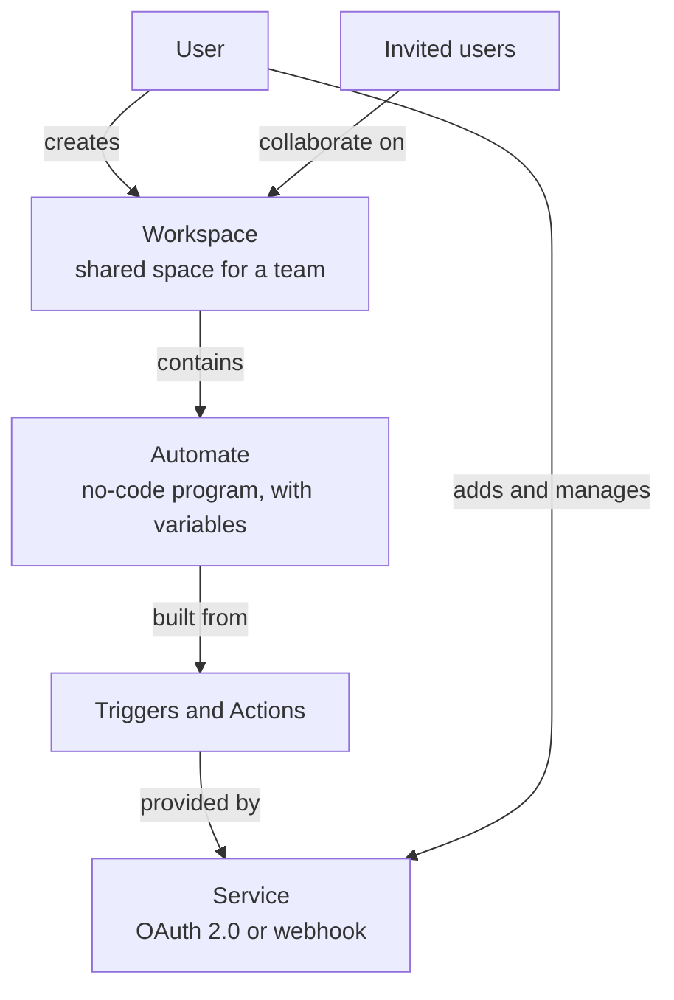
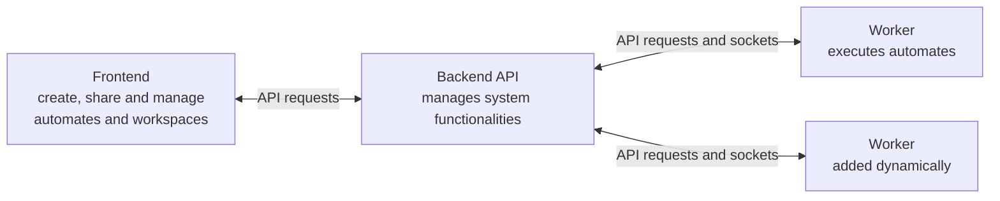

# Linkease

## Project Description

Linkease is an innovative platform inspired by IFTTT (If This Then That), a web-based service that enables users to create chains of simple conditional statements, known as applets. These applets trigger actions in other web services and devices. For more information about IFTTT, visit their website.

Linkease focuses on integrating and automating various services, particularly those compatible with OAuth 2.0 and webhooks. Users can easily add and manage these services on Linkease by filling out a form.

### Features

- **Service Creation:** Add OAuth 2.0 and webhook services to Linkease.
- **Triggers and Actions:** Create triggers and actions within these services, similar to functions that can call each other. This process is supported by a special, no-code program akin to Blueprint or Scratch.
- **Workspaces:** Organize automations into workspaces for group projects, allowing for the creation of no-code programs that utilize triggers and actions.
- **Team Collaboration:** Invite others to collaborate in workspace and service management, fostering teamwork.

### Community Approach

Linkease aims to establish a community-focused IFTTT-like platform. Key community elements include sharing workspaces and automations, and forums for inquiries and assistance, especially for users less familiar with programming.

#### Terminology

- **Automate:** Similar to an IFTTT applet but with increased complexity, including variable systems and advanced features.
- **Workspace:** A shared space among users for team collaboration, containing automates created by the team.

### User Structure



### Global Project Structure

The project comprises a backend, a frontend, and workers:

- **Backend:** An API that communicates with the frontend and workers, managing various system functionalities.
- **Frontend:** The user interface allowing users to create, share, and manage their automates and workspaces.
- **Workers:** Components that execute automates, dynamically added to the project and communicating with the API through API requests and sockets.

The project also includes a canary (test) version and a stable version.



### Useful Links
- [Frontend Repository](https://github.com/AREA-LinkEase/FrontEnd)
- [Backend Repository](https://github.com/AREA-LinkEase/BackEnd)
- [Worker Repository](https://github.com/AREA-LinkEase/Worker)

### How to Run the Project

To run the project, use Docker Compose:

```bash
docker-compose up
```

### Contributors

- Younes Bahri ([@bahmez](https://github.com/bahmez)) - DevOps, Full-Stack Developer
- Simon Vermeulen ([@SimonVermeulen](https://github.com/SimonVermeulen)) - Backend Developer
- Thomas Papaix ([@Thomaspapaix](https://github.com/Thomaspapaix)) - Frontend Developer
- Adil Nouiri ([@AdilNouiri](https://github.com/AdilNouiri)) - Frontend Developer
- Keziah Imer ([@KeziahImer](https://github.com/KeziahImer)) - Backend Developer

### Contact

For any questions or collaboration, please reach any of the contributors listed above through GitHub.

### License

This project is licensed under the MIT License. See the [LICENSE](LICENSE) file for more details.

### Project Status
Completed

### Code of Conduct

Please refer to the [CODE_OF_CONDUCT.md](CODE_OF_CONDUCT.md) file for guidelines on participating in this project.
